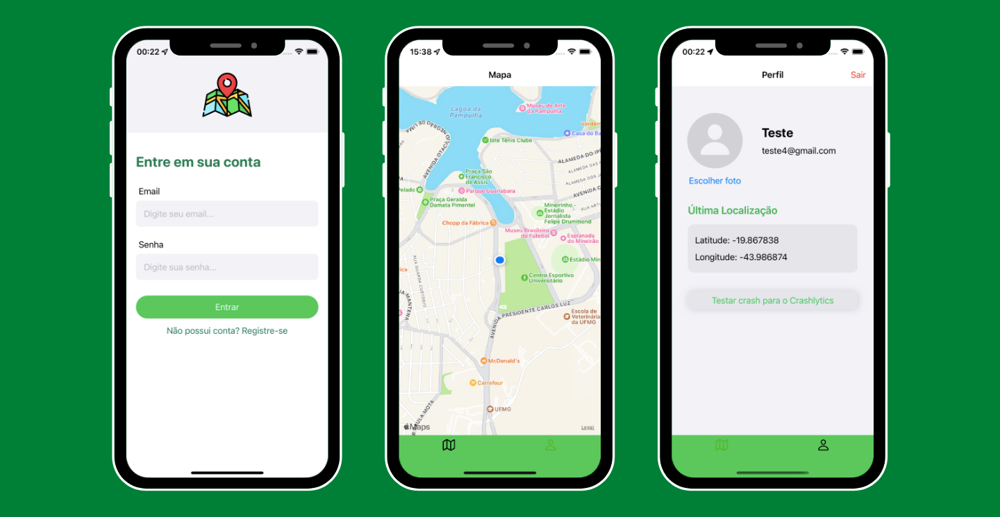
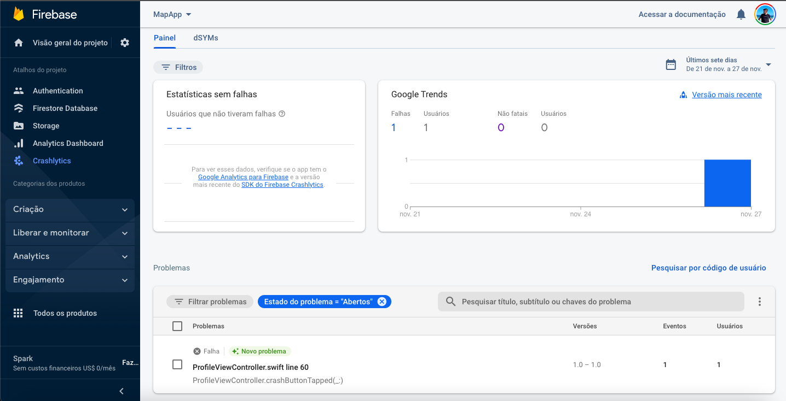
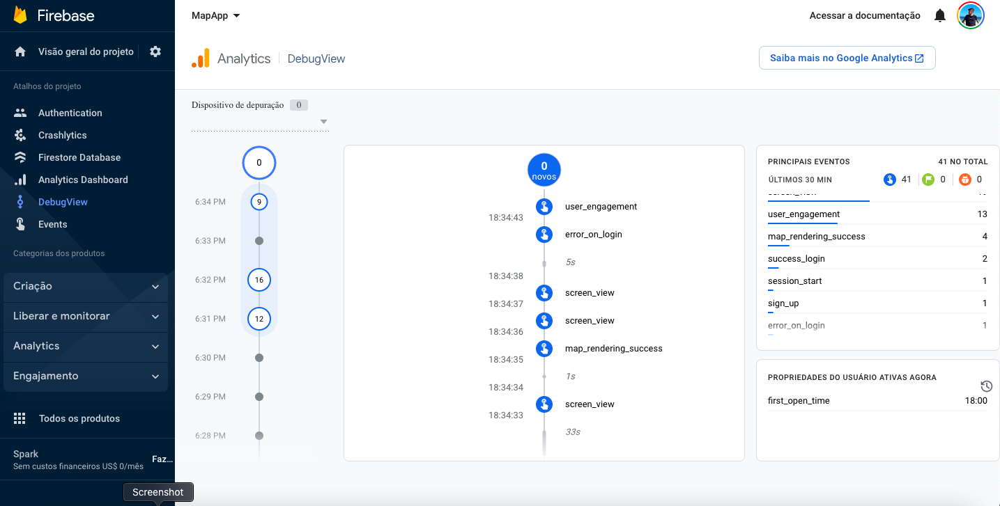

# Desafio programação - para vaga desenvolvedor Mobile
Por favor leiam este documento do começo ao fim, com muita atenção.
O intuito deste teste é avaliar seus conhecimentos técnicos em desenvolvimento mobile.
Este desafio deve ser feito por você em sua casa. Gaste o tempo que você quiser, porém normalmente você não deve precisar de mais do que algumas horas para finalizar.

# Instruções de entrega do desafio

1. Primeiro, faça um fork deste projeto para sua conta no Github (crie uma se você não possuir).
2. Em seguida, implemente o projeto,tal qual descrito abaixo, utilizando sua linguagem de programação mobile preferida em seu clone local.
3. Por fim, envie via email o projeto ou o fork/link do projeto para seu contato bycoders_.

# Descrição do projeto

1. <s>Tela de login usando (email e senha);</s>
2. <s>Tela home com mapa renderizando um ponto na localização atual do device;</s>
3. <s>Realizar o login utilizando Firebase Auth;</s>
4. <s>Armazenar os dados do usuário na store global;</s>
5. <s>Rastrear login com sucesso e renderização com sucesso com Analytics (enviar um evento com dados considerados primordiais nesses dois casos);</s>
6. <s>Rastrear os erros e envia-los ao Crashlytics;</s>
7. <s>Armazenar na base de dados local (preferência por</s> WatermelonDB, <s>mas pode usar outro banco de dados) o usuário logado e sua última posição no mapa;</s>
8. <s>Testar fluxo de login (unit e e2e);</s>
9. Testar fluxo da home (unit e e2e).

# Avaliação

Seu projeto será avaliado de acordo com os seguintes critérios.

1. Sua aplicação preenche os requerimentos básicos?
2. Você documentou a maneira de configurar o ambiente e rodar sua aplicação?
3. Você seguiu as instruções de envio do desafio?
4. Qualidade e cobertura dos testes unitários.

Adicionalmente, tentaremos verificar a sua familiarização com as bibliotecas padrões (standard libs), bem como sua experiência com programação orientada a objetos a partir da estrutura de seu projeto.

# Documentação

Ao rodar o App pela primeira vez, a tela de login irá aparecer onde você pode logar com sua conta. Se não possuir uma conta, você pode clicar no botão de cadastrar e criar a sua conta, e logo em seguida logar no App. 
 
 
Ao logar, você poderá navegar por duas Tabs, a primeira mostra um mapa com a sua localização atual e a segunda mostra os dados do seu perfil (nome, email e última loalização no mapa).
 
 

 
 Na tela de Mapa, para testar o funcionamento, abra o simulador, na barra superior clique em Features > Location > Custom Location e selecione uma latitude e longitude. Isso porque o padrão do simulador é mostrar a localização do usuário na sede da Apple nos Estados Unidos.
 
 
Na tela de Perfil, você também pode escolher uma imagem de perfil ao clicar no botão "Escolher imagem". Logo abaixo, há um botão para testar o crash no Crashlytics. Ao clicar no botão, o App "crasha" e o erro é enviado diretamente para o Crashlytics:
 
 

 
Também foi implementado um rastreamento do login e renderização com sucesso com o Firebase Analytics. Para isso, foram criadas as seguintes chaves: "success_login", que é um evento disparado quando o login de um usuário é efetuado com sucesso, "error_on_login" quando ocorre algum erro ao efetuar o login, "sign_up" que é o recomendado do Firebase e que usa a variável AnalyticsEventSignUp, que é quando o cadastro de um novo usuário é realizado com sucesso, e o "map_rendering_success" que é ativado quando o mapa foi renderizado com sucesso. 
 
 
No Firebase, na aba Debug View, podemos ver o comportamento desses eventos e a quantidade de vezes em que eles são chamados:
 
 

 

